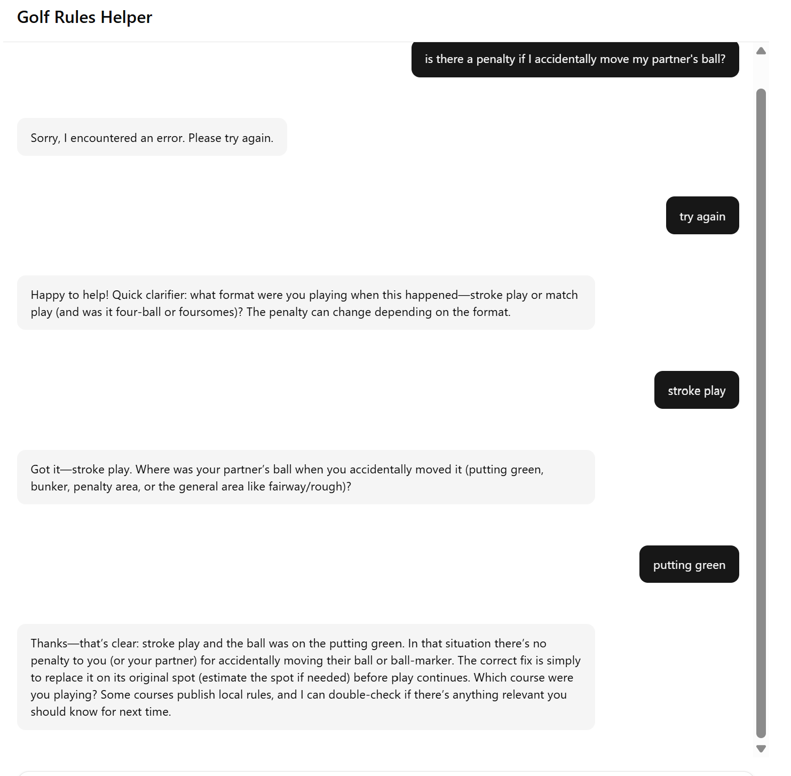

# Golf Rules Helper

An AI Agent that helps golfers with any rules questions in real time.

## Typical information required

To help the agent be more helpful, it helps if you give it the following pieces of information
* Type of game i.e. match play, stroke play etc.
* Description of the situation.
* Any local rules that the agent should be aware of.

# Example run of the agent.

